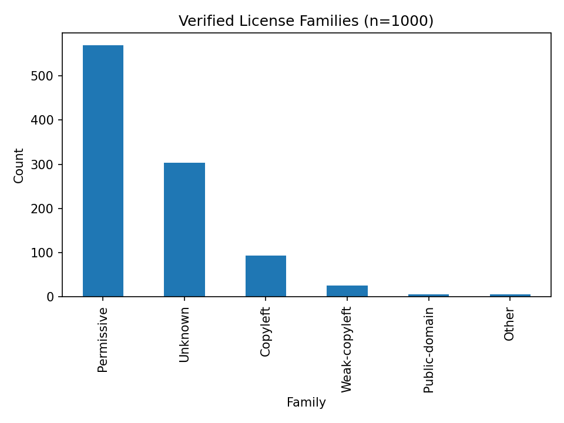

# GitHub License Risk Snapshot (n=1000)

This package shows, in plain English, how many GitHub repos are **permissive** (generally OK to train on with attribution), **weak-copyleft / copyleft** (use allowed with share-alike conditions), and **unknown** (high risk without permission).

## What this is
- We sampled 1,000 repositories and read their license info directly from the **GitHub REST v3 API**.
- We normalized the licenses into families: *Permissive, Weak-copyleft, Copyleft, Public-domain, Other, Unknown*.
- We snapshotted the default-branch commit SHA to show exactly what was observed at verification time.
- See **REPORT.md** (layman summary) and **VERIFIED_1k_SUMMARY.md** (numbers & shifts).

## Headline plots
- 
- See also: pi_family_pie.png, 	op_spdx_bar.png.

## Why it matters (for GenAI platforms)
- **Permissive** (e.g., MIT/Apache/BSD): generally OK to ingest if you keep an attribution log and preserve license texts.
- **Weak-copyleft / Copyleft** (e.g., LGPL/MPL vs GPL/AGPL): allowed but comes with share-alike duties when you distribute covered code or derivatives.
- **Unknown / NOASSERTION**: treat as *no permission* until clarified.

## How to reproduce
1) Put a portfolio.csv (list of owner/repo) in place.
2) python verify_1000.py --input <portfolio.csv> --out verified_1k.csv --summary verified_1k_summary.json --n 1000
3) python plot_api_family.py and python plot_more.py
4) python make_report.py

## Data source & scope
- License fields come from GET /repos/{owner}/{repo} (GitHub REST v3).
- This snapshot reflects licenses at the time of the API call; repos can change later.

## Responsible use (not legal advice)
- This research is **informational**; it is **not legal advice**. Policies & obligations depend on jurisdiction and specific use.
- For commercial deployment decisions, consult qualified counsel.

